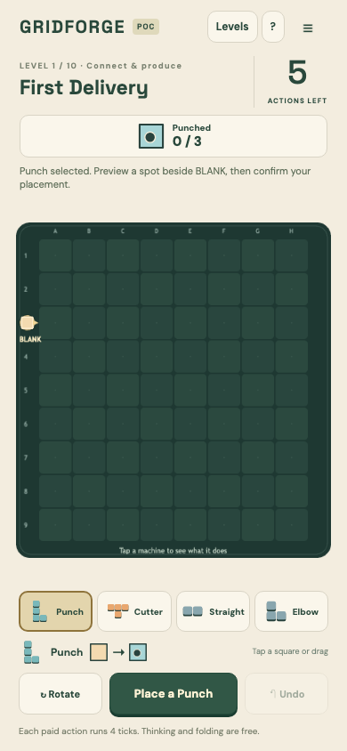
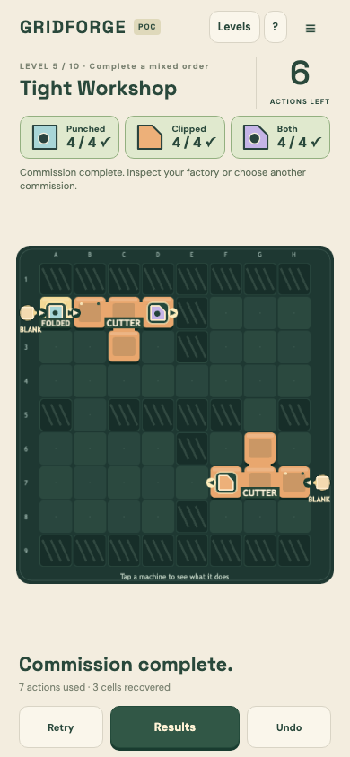

# Gridforge: adversarial design review

19–20 September 2026 · Current prototype plus independently reviewed experiments · No runtime redesign implemented

## Verdict

**Rework the central loop before producing more commissions.** Gridforge currently functions as a small deterministic spatial/batch puzzle. It weakly expresses the desired reward: build a production system, see it work without your intervention, notice a limitation, and improve it. The discrepancy is structural enough that better art alone is unlikely to resolve it.

The strongest next hypothesis is **a pocket toy factory: repair, build, and improve a small visible production line, with tangible objects coming out of it**. Its first reward should be “I made that work.” Its deeper reward should be “I made these competing production needs work together.” A toy-car factory is the concrete example in this review; the theme is a testable presentation choice, not a commitment to a brand or catalogue.

Keep automation. Test whether irregular machine footprints earn their complexity. Reopen the action clock and folding. Compare continuity across a few jobs with independent levels before selecting a campaign structure. **All proposed changes below are approved only as bounded experiments, not as proven product decisions.**

## What was actually reviewed

The review brief was added to the root [AGENTS.md](../AGENTS.md) before the evaluation. Three independent agents challenged mechanics, product/retention, and the replacement proposals. Original REVISE findings were resolved by narrowing or changing the relevant proposal; they were not overruled.

- Source inspection: content, simulation, UI, visual effects, persistence architecture, and previous design decisions.
- Both audit agents executed all ten standard winning replays and five named alternatives through the real reducer, using `node --import tsx tools/replay.ts` after the `tsx` CLI encountered a sandbox IPC restriction.
- Actual Chromium touch playthroughs of Levels 1, 5, and 10 at 390 × 844, with normal animation, plus opening captures at 360 × 640. Representative opening, flow, idle, and completion screenshots were visually inspected. A two-second observation after the first paid action in each played level left the simulation at tick 4.
- [Recorded current gameplay](reviews/evidence/current-gameplay.webm), [capture observations](reviews/evidence/observations.json), and screenshots are retained. The automated recording is evidence of current behavior, not a human session or proposed trailer.
- Primary external references below are used for specific mechanics and comparison. They do not establish market fit or predict retention.

No human playtest, ad conversion test, willingness-to-pay test, or retention cohort was conducted. Severity below means risk to the stated product brief, not a software defect classification.

## 1. Why the current format is not delivering the intended reward

### Critical: the player repeatedly grants permission for the factory to work

Placement, movement, recycling, and Run each advance four ticks. Thinking does not. Production animates for approximately 850 ms and then stops. Across the ten standard witnesses, **25 of 47 paid commands are Run**. The remaining 22 are construction/movement commands; there are also four free folds. These are solution statistics, not measured player behavior. [Reducer](../src/game/simulation.ts#L339), [animation](../src/view/BoardScene.ts#L334).

This can support a good scheduling puzzle: constructing the next useful machine instead of spending Run can be clever. Level 5 demonstrably improves from seven paid actions to six with early construction/folding. The adverse case is that the player experiences Run as a continue button. The factory never establishes the feeling of working for them while they watch.

Continuous simulation alone would not solve this. An unchanged solved line running forever is an idle animation. The missing combination is **automatic work plus a reason to redesign the system**.

### Critical: production decisions are much narrower than the board suggests

Every current primitive has one input and one output. Punch and Cutter each add one binary feature, preserve the other, and take two ticks. Their order does not change the recipe; repeating one adds nothing. There is no assembly from distinct ingredients, shared-resource allocation, branching choice, or alternative production rate. Current networks are serial lines. [Definitions and transforms](../src/game/content.ts#L31).

The 72-cell board suggests room for a factory. Yet the standard witnesses need at most **one to three primitive machines**, and finish with one to three visible machines/modules. Source access and obstacle fitting can be genuine puzzles—the loading bay and corner scenarios have verified transport requirements—but this is a limited foundation for factory mastery.

Adversarial transplant: “finish a single-feature batch, append the other tool, fold when necessary” explains much of Levels 4, 5, 7, 9, and 10. Different coordinates and equal-cost alternative orders do not establish different strategic reasons to play again. More quantities could simply create more Run presses.

### High: the visual result does not make manufacturing desirable

The first phone screen is mostly an empty grid, a small source, and instructions. The finished fifth level has three visible machine/module objects. The tenth level culminates in a cutter and a detached folded module. Products are small silhouettes; shipment creates a small ring and changes a counter above the floor.

The current 390-pixel-wide capture displays the 448-unit canvas at 354 pixels wide. A 14-unit flow sprite is consequently about 11 pixels wide. This is an observed scale, not a proved accessibility failure. It illustrates why a tiny hole versus clipped corner asks for deliberate inspection in a rapidly viewed clip.

The UI is orderly and controls remain visible in the checked sizes. The issue is salience: footprints dominate the image, while the thing being made and the benefit of making it occupy far less attention. “I understand a tile gained a hole” is weaker than “I want to make that production line.”

### High: folding conflicts with the reward of seeing a factory grow

After three emissions, an eligible machine/group can become one cell and relocate freely while retaining all internal work. Ordinary movement costs an action. The renderer hides internal transfers whose endpoints resolve to that same module. [Fold rules](../src/game/simulation.ts#L128), [free fold command](../src/game/simulation.ts#L367), [hidden internal flows](../src/view/BoardScene.ts#L350).

Folding is technically strong and can provide a satisfying compression moment. But it also erases the spatial cost of large shapes, changes their ports, and hides the manufacturing activity. Its strongest current use can be “make room for the next tiny line,” rather than create more interesting automation.

Attack: fold early, reposition for free, and replace a footprint problem with a one-cell connection. This is not proof that every fold is always optimal. It is enough to reject the assumption that folding and Tetris automatically reinforce one another. They can cancel one another's intended role.

### High: reasonable experimentation can lead to a hidden changeover trap

Exact completed quotas refuse more of that product. The surplus stays in bounded buffers. Moving machinery preserves it. The mechanics adversary reproduced a Level 5 cutter finishing combined tiles, then moved it to a blank source to make clipped tiles. **After another 100 simulated ticks, clipped production was still 0/4:** completed combined output blocked the machine permanently under those rules.

This is material conservation working correctly. It is also a likely violation of a casual player's expectation that moving a cutter to a fresh input makes it cut that input. Recycling and replacing works, while the more factory-like attempt to reuse equipment fails. The inspector explains the state, but explanatory text cannot alone establish a satisfying constraint. [Detailed reproduction](reviews/2026-09-19-mechanics-adversary.md).

### High: successful automation quickly loses its purpose

Any unconnected output can ship matching products from anywhere. There is no physical delivery destination to reach. Attaching downstream machinery preempts shipping, even when that consumer blocks. Exact quotas frequently reward completing the old batch before extending the line. Once all quotas finish, the level ends.

The game repeatedly stops at the moment a factory has become functional. Levels can absolutely work for this brief; the problem is that these goals emphasize obtaining a small batch rather than establishing or improving a useful continuing system.

### Medium: the action economy is both forgiving and cognitively expensive

Standard wins consume two to seven actions from budgets of five to fourteen. That leaves recovery room, but does not prove calibrated tension. Tightening budgets would emphasize timing useful construction between production ticks. That might improve a scheduling puzzle while making the intended casual factory toy less welcoming.

One-step full-state undo is valuable. It does not provide unrestricted recovery from a surplus problem discovered several commands later. A move budget also charges for experimentation before the player understands why an apparently sensible placement hurts their previous delivery.

## 2. What is worth preserving

The deterministic reducer, actual buffers/backpressure, correct undo, accurate save/resume, and separation of simulation from rendering are useful foundations. They make a redesign testable. The current UI's clear tool selection and cancellable previews are useful interaction work. The few real lessons—turning around an obstacle, composing transformations, and constructing ahead—should not be dismissed.

The strongest defense of the current game is **a compact turn-based construction puzzle with unlimited thinking**. It could serve an audience that likes exact batch planning and spatial constraints. It has not demonstrated the user's preferred broadly legible, immediately rewarding automation experience. A scoped historical PASS never established that product fit.

## 3. What to borrow from Candy Crush and Factorio

King's documented special-candy system connects a deliberate local arrangement to a large visible consequence: line clears, area clears, and combinations. The relevant design lesson is **a small understandable action producing a much larger understandable result**. This is an inference about the reference, not a claim that copying its structure guarantees success. [King: special candy combinations](https://candycrush.zendesk.com/hc/en-us/articles/211939685-Creating-and-combining-Special-Candies).

For a factory, the corresponding release can be a stopped queue draining, several machines synchronizing, and finished products visibly leaving the line. The player caused the change by fixing the system. Random confetti or a multiplier overlay cannot substitute for that causality.

Factorio describes building and maintaining factories from interacting infrastructure and automated production. The useful compressed experience is noticing what the system needs next and making it work. This review does not propose shrinking its whole technology tree onto a phone. [Factorio](https://www.factorio.com/).

Abstract products are not inherently a mistake: shapez 2 explicitly builds depth through cutting, stacking, painting, recombination, and logistics, with free redesign and no time limit. Gridforge's issue is the narrow composition and modest visible consequence, not merely the absence of cute art. [shapez 2](https://shapez2.com/).

Automation also already exists on mobile. Builderment's own listing includes crafting, conveyors, splitters, research, and blueprints. “Factorio on a phone” therefore does not by itself explain why someone should choose this game. The proposed differentiation is **one readable little factory, quick causal payoffs, and substantial changes made with a few direct interactions**. That remains a hypothesis. [Builderment developer listing](https://play.google.com/store/apps/details?id=com.builderment.builderment).

## 4. The strongest candidate: a pocket toy factory

**Player promise: build a little machine that makes delightful things, then make the whole line work better.**

Use chunky, visibly different materials and finished objects. In the first example, toy bodies arrive at a transparent assembler, wheels wait on a nearby feed, and the completed toys should roll out at an obvious physical exit. The player connects the missing wheel feed. Actual ingredients combine; actual completed cars emerge. Sound can emphasize the rhythm, but the cause and result must read with audio muted.

The body press, assembler, and router are the maximum three machine roles in this experiment, with belts as transport. The second finished output is a spare-wheel kit delivered to a separate consumer. This gives wheel supply two competing uses without introducing a catalogue of recipes. No general power grid, fluids, research tree, crafting menus, or economy is selected here.

The first vignette provides one obvious feed problem. Later tasks must require fresh construction and choosing between plausible solutions. If the complete game is always “insert the missing elbow,” it fails this recommendation even if its ads look good.

### A truthful ten-second clip

| Time         | What the viewer sees                                                                                         | Why it matters                                                      |
| ------------ | ------------------------------------------------------------------------------------------------------------ | ------------------------------------------------------------------- |
| 0–2 seconds  | A few toy bodies wait at the assembler; a short wheel queue cannot reach it; the finished-toy lane is empty. | The problem is physical and legible before instructions.            |
| 2–4 seconds  | The player places/connects the missing feed with a visible preview. Editing visibly pauses the scene.        | The intervention is small and attributable.                         |
| 4–7 seconds  | The line resumes; wheels join bodies; the first complete car rolls down the exit.                            | Manufacturing is visible rather than represented only by a counter. |
| 7–10 seconds | The next few cars follow automatically and the blocked queue drains.                                         | The system keeps working because of the player's change.            |

These timings are storyboard targets, not measured prototype performance. Show only what the simulation actually produces. A bounded queue may not deliver a screen-filling avalanche. Camera editing must not hide manual work needed between each item.

### The next twenty seconds

The same shot includes a second physical destination for spare-wheel kits. Both that destination and car assembly need wheels. A line that looks healthy at one exit can starve the other. The player pauses, changes routing/allocation, resumes, and sees both streams respond. The actual number and spacing of outputs demonstrate the change; an invented “×100” does not.

The longer clip communicates a game beyond the initial repair: deciding how a shared feed serves a production network. Demand is disclosed, not sprung as random sabotage for the trailer. If this explanation cannot be conveyed with visible queues and products, the mechanic is too opaque for the opening scope.

### What the player does between satisfying moments

Observe where objects wait or where a machine lacks input; choose a placement, route, or allocation; preview it; run the line; inspect the result; keep or revise the design. Automation performs repeated work. The player changes the system, rather than tapping every product through it.

In the experiment, observation runs continuously, editing pauses, and backgrounding pauses. No offline accrual or deadline is introduced. Rearrangement is free and reversible. **Floor space, a finite machine inventory, shared supply, and simultaneous output needs provide constraints.** Removing a move limit does not mean removing consequences or goals.

Ordinary practice preserves its real buffers when editing pauses and resumes. The opening repair is unscored practice: its existing backlog really drains. It does not claim to prove sustained throughput.

Only the later depth task introduces an explicit **Check design** action. This tests a clone of the chosen layout from empty buffers and a fixed source phase, so preloading stock cannot fake production capability. The scene clearly identifies the fresh test. Editing is locked until cancellation returns to the unchanged paused practice snapshot; editing that layout invalidates any previous measurement and requires another explicit check. The test never silently discards practice inventory.

Sustainable throughput must be established by the actual small deterministic network, not a short burst of stored output. The mathematical verification belongs to authoring; if the player needs to understand that machinery to enjoy the goal, the experiment fails usability. This separation received its own D3b PASS after the final reviewer caught ambiguity in the earlier Test/Resume wording. If switching between practice and verification feels like taking an exam, causes mode confusion, or demands repeated long waits, revise or reject it. It is not an accepted release behavior.

## 5. Tetris: earn the footprint or simplify it

Shaped pieces can provide a distinctive tactile action: rotate a physical machine and fit it into the one useful gap while keeping its ports connected. That is worth testing. They can also force repeated rotation/pose search before the player gets to the enjoyable production consequence.

**Retaining shapes exactly as now** preserves recognizable identity and existing content, but free folding can erase the constraint they create. **Simplifying to readable rectangles** reduces placement friction while keeping floor and port decisions. **Removing packing pressure entirely** risks exposing a trivial pipeline unless the production network has enough resource/capacity decisions. None is universally correct.

Run a matched-task comparison of irregular shapes and rectangles with the same machine roles, rates, and explicit port rules. Record manipulation errors, time to correct connection, distinct useful layouts, reasons for choosing a layout, and voluntary experimentation. Footprint changes alter packing possibilities; do not falsely describe this as an isolated test of silhouette preference.

The default recommendation for the first experiment is to keep shapes as a variable, rather than insist on all seven tetrominoes or remove geometry by ideology. A player should sometimes be pleased that a shape fits or choose it for a reason. If shapes mostly delay connecting an obvious chain, simplify them. Current folding stays disabled in the experimental variant; the existing game remains available as a control. No replacement folding mechanic has been approved.

## 6. Levels versus a persistent factory

| Structure                                        | Strongest case                                                                              | Adversarial failure                                                                                                |
| ------------------------------------------------ | ------------------------------------------------------------------------------------------- | ------------------------------------------------------------------------------------------------------------------ |
| Independent authored levels                      | Immediate fresh situation, bounded phone complexity, clean difficulty teaching, easy retry. | Repeatedly destroys investment; begins with empty setup and finishes at first functional output.                   |
| One persistent factory                           | Ownership, anticipation, an earlier decision affecting a later job.                         | A universal layout solves everything; or each order demands tedious teardown. Re-entry and screen complexity grow. |
| A few jobs on one factory, then another workshop | Can test continuity without committing to an endless world.                                 | May inherit both teardown friction and repeated resets; “hybrid” is not itself a solution.                         |

**Compare three disclosed jobs on the same saved board with three equivalent standalone jobs.** Preserve a chapter-start snapshot, clear job checkpoints, and voluntary replay. Counterbalance which version participants see first. This tests attachment, redesign costs, and re-entry; three jobs cannot establish long-term retention.

The adversarial requirement is especially important: attempt to satisfy all jobs with one maximum-capacity layout. If it works without an interesting design choice, the job sequence has failed. Do not repair that by concealing future orders. Also count cases where adaptation amounts to moving the same pieces over and over. Continuity is valuable only if prior construction makes the next decision more interesting.

My preference is to investigate bounded continuity first, because it could preserve the feeling of building something. It is a ranked experiment, not a decision that the game must abandon levels.

## 7. How this could stay interesting—and where it could still fail

The first ten seconds can sell **relief and authorship**. The next few minutes must demonstrate **choice**. Repeat play requires problems where an earlier solution is useful knowledge but not an automatic answer. Later returns require a reason to resume, improve, or build another factory. These are different claims and need different evidence.

The proposed three-role test can examine assembly starvation, shared input allocation, route length/space, and backpressure together. One layout could favor quick direct supply while using scarce floor; another might preserve useful space while creating congestion. These are tradeoffs to demonstrate with actual competing layouts, not assertions that the prototype already has depth.

The router experiment is deliberately specified: choose a fixed cyclic 1:1 or 2:1 allocation while paused; routing then runs automatically. It does not skip a blocked scheduled destination, and advances its cursor only on a successful transfer. This makes the allocation literal but can block a healthy branch behind a full one. If that behavior requires repeated explanation, revise the design; do not conceal it behind prettier animation.

The strongest attacks on the proposed direction are:

1. **One correct gap.** Repair looks satisfying but has no meaningful construction decisions. Require a fresh-build task and alternative repair choices after the introduction.
2. **One universal factory.** Maximize capacity once and every order completes. Attempt to transplant the same layout across all test jobs.
3. **Waiting wins.** Any dribble eventually meets a quantity target. Use verified simultaneous ongoing delivery requirements for the depth test.
4. **Stored stock wins.** Bank inventory, burst to the quota, then starve. Test from standardized empty state and verify ongoing operation.
5. **Manual dispatch wins.** Constant toggling outperforms designing automation. Allocation is fixed during operation in this prototype.
6. **The good clip lies about the game.** Only scripted repairs look spectacular; normal construction is long and fiddly. Capture normal unaided attempts as well as prepared examples.
7. **The toy skin does all the work.** People like watching cars but do not choose to build the line. Separate clip preference from voluntary play.
8. **Persistence becomes maintenance.** Returning means decoding old mess or rebuilding for a new order. Test later re-entry and reasons for stopping.
9. **The rate goal becomes homework.** A numeric dashboard obscures the physical problem. Failure to understand through the scene is a design failure, even if the simulator is correct.

This is a plausible route to depth, not evidence of a long-lived game. Do not build a large progression tree to camouflage a lack of compelling decisions in the small test.

## 8. Ranked directions and deferrals

1. **First: the pocket toy-factory experiment.** It most directly connects a small mobile action to visible automated output. Product and detailed mechanic reviews approve this only as a bounded experiment.
2. **Second: the shaped-machine variant of that experiment.** Keep it if packing adds satisfying decisions with acceptable touch manipulation; otherwise simplify. This is an A/B axis, not a separate production pipeline.
3. **Low-cost control: improve actual shipment feedback in the current turn-based game.** Preserve all existing rules and replay outcomes; cosmetic collection feedback must not silently add a fixed delivery destination. This can test how much the presentation is suppressing an existing payoff. It cannot establish that the deeper loop is sufficient.

**Defer real-time falling pieces and overflow loss as the main redesign.** Their strongest case is an immediately legible arcade crisis and repeatable skill ceiling. Their cost is reflex pressure and accidental congestion competing with deliberate factory construction. This is not a blanket rejection of every factory game with falling pieces.

**Reject a number-only idle/merge replacement as the primary recommendation.** Merging can be a legible satisfying action, and idle games can have an audience. But if progress mainly means buying a numerical multiplier, the intended factory-design decisions disappear. Physical merging that changes footprints, recipes, or ports remains an untested separate idea; it is not approved or ruled out here.

**Defer a large campaign, generated content volume, permanent progression economy, and monetization.** Earlier commercial hypotheses remain historical, scope-limited proposals. None resolves the present question of why the player wants another minute with the machine.

## 9. Review ledger

The detailed original proposals, counterexamples, revisions, and evidence requirements live in the independent reports. All listed decisions received a final **PASS**, after revisions where noted. PASS means permission to test the stated scope only.

| ID     | Decision                                                                                               | Final scope                                                                                                               |
| ------ | ------------------------------------------------------------------------------------------------------ | ------------------------------------------------------------------------------------------------------------------------- |
| D1     | Tangible toy transformation and physical output payoff                                                 | Prototype experiment                                                                                                      |
| D2     | Continuous observation; paused edit/background; no offline/timed pressure                              | Prototype experiment                                                                                                      |
| D3/D3b | Free edits, finite floor/inventory, sustainable output requirement                                     | Preserved practice plus explicitly labelled cloned empty-state check; verified ongoing operation; prototype specification |
| D4     | Simple bottleneck opening followed by construction and alternatives                                    | Prototype experiment                                                                                                      |
| D5     | Irregular-shape versus rectangle comparison                                                            | Matched-task experiment; no isolated-causation claim                                                                      |
| D6     | Disable folding in experimental variant                                                                | Diagnostic experiment; no permanent deletion                                                                              |
| D7     | Two-input assembly and automatic competing supply allocation                                           | Revised to explicit cyclic no-skip policy and physical second consumer; prototype specification                           |
| D8     | Three preserved jobs versus three standalone jobs                                                      | Comparative experiment; no retention claim                                                                                |
| D9     | Truthful ten-second hook and thirty-second extension                                                   | Storyboard/recording hypothesis                                                                                           |
| D10    | Separate comprehension, desire, transfer, and return measurements                                      | Validation method                                                                                                         |
| R1–R3  | Prioritize toy-factory trial, compare structures, defer commercial conclusions                         | Product experiment priorities                                                                                             |
| A1–A4  | Presentation control; defer arcade falling pieces; reject number-only replacement; defer content scale | Narrowed recommendations and control only                                                                                 |

See [mechanics adversary](reviews/2026-09-19-mechanics-adversary.md), [product adversary](reviews/2026-09-19-product-adversary.md), and [direction adversary](reviews/2026-09-19-direction-adversary.md). Detailed verdicts remain authoritative if a summary loses a qualification.

## 10. Smallest useful validation plan

Build no broad redesign yet. The next implementation scope, if selected, should be one convincing manufacturing vignette and enough adjacent tasks to attack it: the simple repair, a fresh construction challenge, and a competing-output problem. The persistent-versus-standalone comparison follows only if this local loop is understandable and players want more.

**Stage 1 — Does the clip communicate the promise?** Show a silent ten-second capture once to a small mixed group of casual mobile players and factory/puzzle players. Ask what was being made, what stopped it, what the player changed, and what they would do next. Ask open questions before revealing the intended explanation. A useful provisional gate is at least six of eight viewers accurately explaining action and effect. This is an early redesign trigger, not a benchmark or a population estimate. Log answers by audience; do not hide segment differences in the average.

**Stage 2 — Does that promise survive touch play?** Give fresh participants the opening and fresh-build task without coaching. Record time to first intentional working connection, cancellations/rotation errors, whether they diagnose stalls in the scene, and where they stop. “First visible result within roughly thirty seconds of gaining control” is a provisional usability target. Completion assisted by hints is not counted as unaided understanding. Use actual phones as well as emulated viewports.

**Stage 3 — Is there desire to continue?** After a task, make a second layout available and make stopping equally acceptable. Observe the choice without asking them to demonstrate politeness. Ask what they want to try differently. An initial investigative gate could be five of eight opting into another layout with a concrete production idea, demonstrated in play or expressed in their own words; failed attempts motivated only by confusion do not count as positive replay evidence. A sample this small identifies failure cases, not retention rates. These research targets received separate product-adversary PASS verdicts as exploratory decision rules, not automatic permission to scale.

**Stage 4 — Does the decision structure survive attack?** Execute actual alternative layouts, transplant the strongest plan across tasks, try earliest maximum-capacity construction, hoarding/burst delivery, indefinite waiting, manual toggling, source starvation, blocked branches, and edits mid-trial. Reject a task whose intended tradeoff vanishes. Compare shapes without introducing an unacknowledged rate/port advantage.

**Stage 5 — Does continuity create attachment?** Only then compare the two three-job structures and later re-entry. Returning after a research invitation establishes re-entry usability; independently choosing to return is different evidence. Track the reason to return, not just an app open. Longer-term retention, content cost, and economics require a larger subsequent study, not projections from this group.

Stop or revise if the clip is appealing but players dislike construction; if the second task is solved by copying with no thought; if quantitative targets become opaque; or if most time is spent rearranging rather than learning something about production. Do not answer those failures by simply adding another theme, recipe, or level.

## Recommended next decision

Approve or reject the **small toy-factory experiment**, not a full game pivot. Its value is that it tests the desired causal pleasure directly: a tiny intervention makes a system visibly produce on its own. The current prototype remains a useful comparison, but its solvability and correctness are no longer reasons to assume its format should lead the product.
